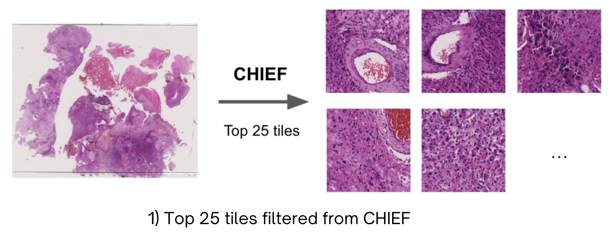
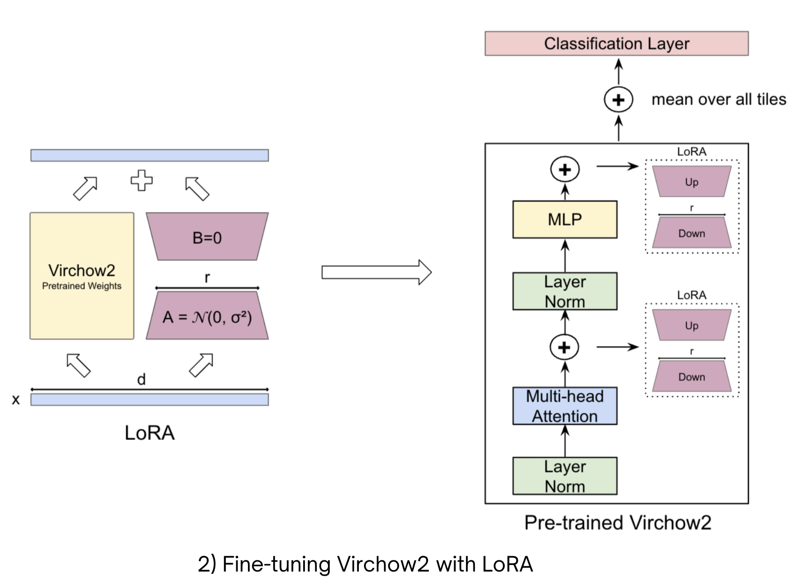

# PEFT in Computational Pathology

### Improving Pathology Foundation Models for Brain Tissue using Parameter-Efficient Fine-Tuning


## Abstract
>Foundation models in computational pathology, such as CTransPath, CHIEF, and Virchow2, have demonstrated strong performance on cancer tasks, often integrated into multi-model frameworks like EAGLE for efficient whole-slide image (WSI) analysis. However, their generalization to out-of-distribution (OOD) data remains challenging, especially for anatomically and diagnostically distinct domains such as brain histopathology. We hypothesize that these models, pre-trained on heterogeneous yet predominantly non-brain datasets, have incomplete representation capacity for brain tissue morphologies, particularly for rarer diagnostic categories. Parameter-Efficient Fine-Tuning (PEFT) methods such as LoRA could selectively adapt model to enhance domain-specific representation while retaining the general features learned from large-scale pre- training.


## 🎯 Method Overview

### **Attention-Guided Top-k Tile Selection**

We leverage **CHIEF** attention mechanisms applied to **CTransPath** features to identify and extract the most diagnostically informative regions from each whole-slide image. This approach focuses computational resources on relevant tissue morphologies rather than processing all pixels.

<p align="center">
  
</p>

### **LoRA Adaptation on Virchow2**

We insert lightweight **LoRA adapters** into the attention and MLP blocks of the **Virchow2** foundation model. Tile embeddings are aggregated and fed to a slide-level classifier. Critically, only the LoRA parameters and classification head are trained, reducing trainable parameters by orders of magnitude.

<p align="center">
  
</p>

### Why This Approach Works

- **Focus** — Prioritize diagnostically relevant context (Top-k tiles) over exhaustive pixel processing
- **Retain** — Preserve strong inductive priors from pathology foundation models (Virchow2)
- **Adapt** — Efficient domain specialization with LoRA (≪1% trainable parameters)


## 🚀 Getting Started

### Installation

Install the required dependencies from [requirements.txt](requirements.txt):

```bash
pip install -r requirements.txt
```

### Prerequisites

Before running the PEFT pipeline, ensure you have the following:

#### Required Model Checkpoints
- **CTransPath** weights for feature extraction  
  → Download from the official [TransPath repository](https://github.com/Xiyue-Wang/TransPath)
- **CHIEF** model weights  
  → Available at [CHIEF repository](https://github.com/hms-dbmi/CHIEF)
- **Virchow2** foundation model weights  
  → Access via [Hugging Face](https://huggingface.co/paige-ai/Virchow2)

#### Dataset
- **EBRAINS Dataset** (The Digital Brain Tumor Atlas)  
  → Download from [EBRAINS Knowledge Graph](https://search.kg.ebrains.eu/instances/8fc108ab-e2b4-406f-8999-60269dc1f994)


## 📊 Data Preparation

### Step 1: Generate Slide Tables

Organize the dataset by creating slide tables that map WSI files to their diagnostic labels:

```
python dataset/generate_slide_tables.py \
  <path_to_dataset_root> \
  <output_directory>
```

**Output:** CSV files containing slide metadata, labels, and file paths organized by diagnosis categories.


## 🔬 Feature Extraction Pipeline

### Step 2: Extract CTransPath Features

Generate patch-level features at 2.0 MPP (microns per pixel) for all slides:

```
python feature_extraction/ctranspath_features.py \
  --slide_table <path_to_slide_table.csv> \
  --output_dir <ctranspath_features_output> \
  --weights_path <path_to_ctranspath_weights.pth>
```

**Note:** CTransPath features are computed once and reused for all downstream tasks. (Requires [timm-0.5.4](timm-9.5.4.tar) to function for compatibility)

### Step 3: Select Top-k Diagnostic Tiles

Use CHIEF attention to identify the most informative tiles per slide:

```
python feature_extraction/top_tiles.py \
  --slide_table <path_to_slide_table.csv> \
  --output_csv <output_tile_table.csv> \
  --model_weights_dir <path_to_model_weights> \
  --ctranspath_features_dir <ctranspath_features_output> \
  --tiles_output_dir <extracted_tiles_output>
```

**Output:** A CSV file containing paths to the top-k tiles per slide and corresponding image patches.


## 🎓 Training

### Step 4: Train Virchow2 with LoRA

Configure the experiment in `configs/main.yaml`, then launch training:

```
python run_lora_training.py --config configs/main.yaml
```

**Configuration:** Edit `configs/main.yaml` to customize training parameters

**Outputs:**
- Model checkpoints saved to `output_dir/checkpoints/`
- Training configuration and metrics logged

## 📈 Evaluation

### Step 5: Evaluate Trained Models

Evaluate a trained checkpoint on the test set:

```
python run_lora_evaluation.py \
  --checkpoint_path <path_to_checkpoint.pth> \
  --output_dir <training_output_directory> \
  --config_path configs/main.yaml
```

## 🧠 Acknowledgments

This work builds upon several outstanding open-source projects including EAGLE, TransPath, CHIEF, Virchow2, Timm and PEFT. We are grateful to the authors and maintainers of these exceptional resources.

## 📄 License

This project is released under the [LICENSE](LICENSE) file in this repository.

<p align="center">
  
</p>